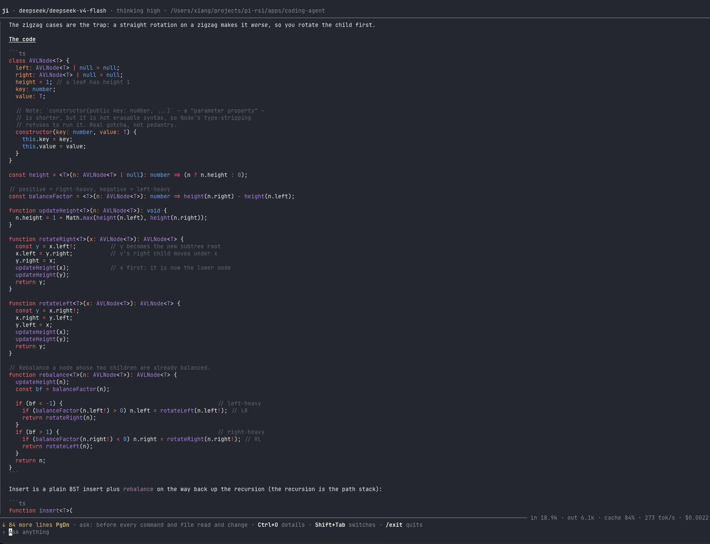

# Coding agent

**English** · [简体中文](README.zh-CN.md)

> Still in development: behavior and keys may change.

Read code, edit files and run commands with a model, in your terminal. It asks before it acts, and you can steer or stop it at any time.



```bash
export DEEPSEEK_API_KEY=sk-...
pnpm coding-agent
```

Needs Node 24+. **It works in the directory you start it from.** To use it on another project, run `node <this repo>/apps/coding-agent/src/main.ts` there.

## Signing in

`/login openai` signs in with ChatGPT in the browser, so a Plus or Pro subscription answers instead of an API key; `/login deepseek` asks for the key and keeps it. Either goes to `~/.ji/auth.json`, readable by you only, and `/logout <provider>` forgets it. Pick the model with `pnpm coding-agent --model openai/gpt-5.5`; headless reads the same file.

## Safety

- By default, every command, file read and file change waits for your yes. **Shift+Tab** switches to auto: reads and changes inside the workspace go ahead, commands are still asked about.
- **Files outside the workspace are always asked about**, in either mode, with No selected.
- A yes can say not to ask again. What it allowed stays in the bottom bar; switching back to ask takes it all back.
- `pnpm coding-agent --yolo` asks about nothing, outside the workspace included, for the whole session. For a sandbox or a checkout you can throw away.

## Stopping

**Ctrl+C** stops the reply: the conversation goes back to before you sent, and your message returns to the input. **Files already written stay changed.** The notice lists them; use git to undo.

## Keys

| Key              | Does                                                                |
| ---------------- | ------------------------------------------------------------------- |
| Enter            | Sends; during a reply, steers it after the step in progress         |
| Ctrl+C           | Stops the reply / clears the input / quits                          |
| Esc              | Dismisses the question; an approval counts as No                    |
| Shift+Tab        | Switches ask / auto (not in yolo)                                   |
| Ctrl+O           | Shows the details: full thinking, every call's arguments and result |
| `/think <level>` | `off` / `high` / `xhigh`                                            |
| `/help`          | Lists the keys, the commands and the tools                          |
| `/exit`          | Quits                                                               |

`DEEPSEEK_MODEL` (default `deepseek-flash`) and `DEEPSEEK_THINKING` (default `high`) set the model and thinking level. The mouse wheel scrolls, so hold Option to select text. On exit the conversation is printed back to the terminal.

[Architecture →](docs/architecture.md)
